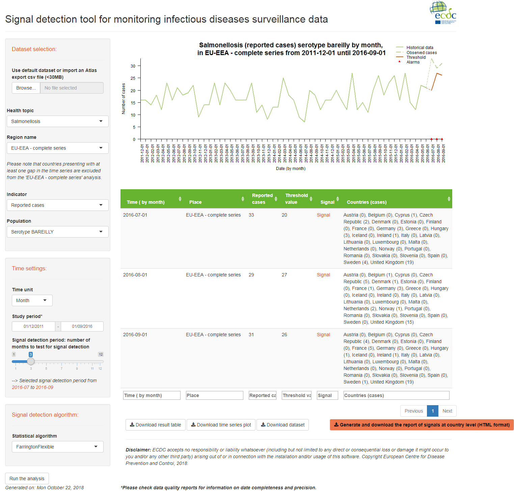
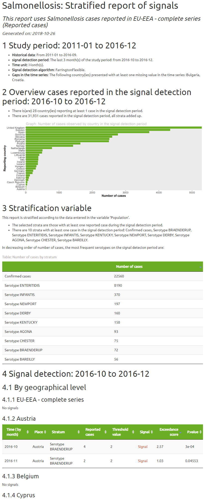

% '_EpiSignalDetection_' package
European Centre for Disease Prevention and Control (ECDC)

# Description
The 'EpiSignalDetection' package allows the user to explore time series for signal detection. 
It is specifically designed to detect possible outbreaks using infectious disease surveillance data 
at the European Union / European Economic Area or country level.

The package includes:

* __Signal Detection tool (Fig.1)__ an interactive 'shiny' application 
in which the user can import external data and perform basic signal detection analyses;
* __An automated report (Fig.2)__ in HTML format, presenting the results 
of the time series analysis in tables and graphs. This report can also be 
stratified by population characteristics (see 'Population' variable).

 
 

__Fig.1 Signal detection tool for monitoring infectious diseases in TESSy__

 
 
 

__Fig.2 Report of alarms__

...

