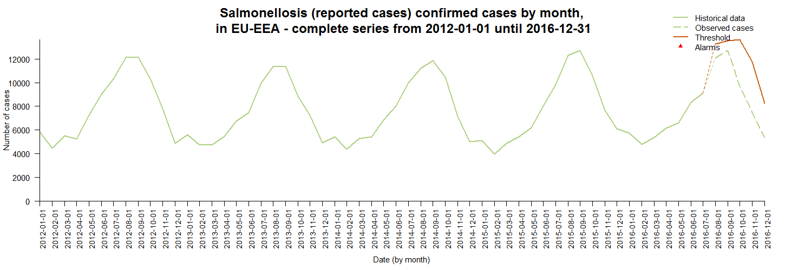
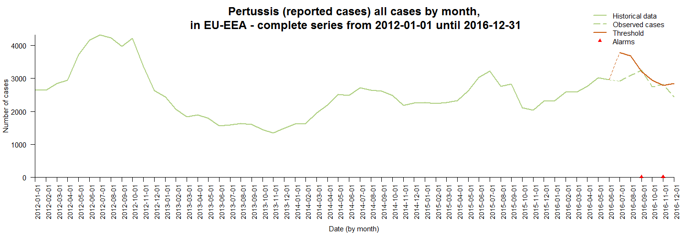

<style>
  .myTable td {
    width: 400px;
  }
</style>


```{r setup, include = FALSE}
knitr::opts_chunk$set(
  collapse = TRUE,
  comment = "#>"
)
```

## Description

The EpiSignalDetection package allows the user to explore time series for signal detection. 
It is specifically designed to detect possible outbreaks using infectious disease 
surveillance data at EU/EEA or country level.

The package includes:

* __Signal Detection tool__, an interactive 'shiny' application in which 
the user can import external data and perform basic signal detection analyses;
* __An automated report__ in HTML format, presenting the results of the time series 
analysis in tables and graphs. 
This report can also be stratified by population characteristics 
(see 'Population' variable).

Package details below:

```{r, echo = FALSE}
pkgVersion <- packageDescription("EpiSignalDetection")$Version
pkgDate <- packageDescription("EpiSignalDetection")$Date
authorsString <- gsub("^ *|(?<= ) |\n| *$", "", 
                      packageDescription("EpiSignalDetection")$Authors, perl = TRUE)
authorList <- eval(parse(text = authorsString))
pkgAuthors <- paste(format(authorList, 
                           include = c("given", "family", "email", "comment"), 
                           braces = list(email = c("<", ">,<br />"), comment = c("", ""))), 
                    collapse = "<br /><br />")
pkgMaintainer <- packageDescription("EpiSignalDetection")$Maintainer
pkgLicense <- packageDescription("EpiSignalDetection")$License
pkgUrl <- packageDescription("EpiSignalDetection")$URL
```


Package | Description
------- | -------------
Version | `r pkgVersion`
Published | `r pkgDate`
Authors | `r pkgAuthors`
Maintainer | `r pkgMaintainer`
License | `r pkgLicense`
Link to the ECDC Atlas | `r pkgUrl`


## Background

The monitoring of routinely collected infectious disease surveillance data has 
the potential to ensure that relevant changes 
in disease incidence such as possible outbreaks are promptly recognised, 
investigated and that control measures are initiated in a timely manner. 
Due to the large amount of data being collected as part of such surveillance, 
there is a need to develop automatic detection algorithms, 
which can assist epidemiologists in this task. 

Statistical methods ranging from time series modelling to statistical process 
control are used to visualize, 
analyse and monitor the data in order to generate signal 
These signals do not necessarily correspond to outbreaks but they allow effective 
screening of surveillance data 
for outliers when monitoring data from many serotypes and/or geographical areas.

The ECDC biostatisticians piloted the implementation of automated analysis using 
signal detection algorithms on data retrieved from the European Surveillance 
System (TESSy) for signal detection in order to improve the monitoring of disease surveillance data 
for potential outbreaks. 

The main outputs of this project included this __Signal Detection tool__, 
an interactive Shiny application, 
aiming to monitor infectious diseases in TESSy through a basic user interface. 
The tool allows the end user to investigate TESSy data 
(or external data in a specific format) through a set of choices of parameters such as:

* the disease on interest;
* the indicator to plot;
* the population to focus on;
* the geographical level, aggregated data (EU/EEA level) or country level data;
* the time unit for the time series;
* the study period to use as historical data for the detection algorithm;
* the number of weeks/months to test for signals;
* the signal detection algorithm to use.

A complete __report of signals at country level__ in HTML format was also 
designed to summarise the results of the previous signal detection
investigation by country. An additional option allows the end user to draft 
the full report of signals stratified by population characteristics.


##  I. Specifications of the interactive Shiny application: Signal detection tool for monitoring infectious diseases in TESSy data

The user interface of the Signal detection tool is made available once the 
`EpiSignalDection` package is installed, 
and by running the following commands in the R console:

```{r, eval=FALSE, echo=TRUE}
install.packages("EpiSignalDetection")
library(EpiSignalDetection)
EpiSignalDetection::runEpiSDApp()
```

At this moment, an external window will appear using the default browser (see print screen below):


The end user can then select the parameters of interest (e.g. Salmonellosis, 
EU-EEA complete series, Reported cases, etc.) and push the button `Run the analysis`.


### 1. Datasets to be used in the Epidemiological Signal Detection Tool

Three types of datasets can be used in the tool:

* The default dataset included in the `EpiSignalDetection` package: `EpiSignalDetection::SignalData`;
* A basic ECDC Atlas export (csv format) exported from http://atlas.ecdc.europa.eu/public/index.aspx;
* Any dataset specified as described below.


#### Dataset specification (naming, format, description)

* `HealthTopic`: Character string, disease name;
* `Population`: Character string, population characteristics 
(e.g. All cases,  Confirmed cases, Serotype AGONA or Serotype BAREILLY etc.). 
Please note that this variable can be used as a stratification variable in the HTML report of signals;
* `Indicator`: Character string, indicators available 
(e.g. Hospitalised cases, Reported cases, Number of deaths, etc.);
* `Unit`: Character string, unit of the `NumValue` variable. `'N'` stands 
for number of cases, `'N/10000000'` stands for rate, `'%'` stands for proportion. 
Please note that in the tool, only `'N'` number of cases are used;
* `Time`: Character string, time variable including dates in any formats available 
in the tool i.e. yearly data %Y (e.g. 2001), monthly data %m (e.g. 2001-01) 
or weekly data in ISO week format (e.g. 2001-W25);
* `RegionCode` _(optional)_: Character string, geographical level in coded format, 
not used in the tool;
* `RegionName`: Character string, geographical level including full country names 
(e.g. Austria, Belgium, Bulgaria, etc.);
* `NumValue`: Integer, number of cases.


```{r, echo=FALSE, results='asis'}
my_dataset <- EpiSignalDetection::importAtlasExport("./data/ECDC_surveillance_data_Pertussis_20180717.csv")
knitr::kable(head(my_dataset), 
             format = "html", table.attr = 'class="myTable"',
             format.args = list(decimal.mark = ".", big.mark = ","),
             align = 'c',
             caption = "__Tab.1 Example of Pertussis data exported from the ECDC Atlas__")
```


```{r, echo=FALSE, results='asis'}
my_dataset <- EpiSignalDetection::SignalData
my_dataset <- dplyr::filter(my_dataset, my_dataset$HealthTopic == "Salmonellosis")
my_dataset <- dplyr::group_by_(my_dataset, c("Population") )
my_dataset <- dplyr::summarise(my_dataset, "NumValue" = sum(NumValue, na.rm = TRUE))
my_dataset <- dplyr::ungroup(my_dataset)
my_dataset <- dplyr::arrange(my_dataset, desc(my_dataset$NumValue))
knitr::kable(my_dataset,
             format = "html", table.attr = 'class="myTable"',
             format.args = list(decimal.mark = ".", big.mark = ","),
             align = 'c',
             caption = "__Tab.2 Number of cases in each stratum using Salmonellosis data exported from the ECDC Atlas__")
```


#### Time units available in the tool

The current tool handles weekly and monthly data.

For weekly aggregation, we use ISO8601-week. Working with ISO-weeks implied that 
we have 53 weeks in some years, e.g. 2009 and 2015. 
ISO week 52 and 53 can sometimes include dates from the following year, 
and conversely ISO week 1 can sometimes include 
dates from the previous year.


#### Handling missing data

In the ECDC Atlas, missing data are identified by `' - '`. However, time points 
could be missing in the time series.
The current tool will compute a complete time series and identify any missing 
time points in the given dataset, meaning tha countries presenting with at least 
one missing value in the time series are excluded from the 
'EU-EEA - complete series' analysis.


### 2. Detection algorithms available in the tool

Two detection algorithms are available in the tool: the Farrington Flexible and 
the Generalized Likelihood Ratio statistic for Negative Binomial distribution (GLRNB).
These algorithms are implemented in the R package __surveillance__ [^1].

[^1]: Hohle M (2007), surveillance: An R package for the surveillance of infectious 
diseases Computational Statistics, 22(4), pp. 571-582.

The __Farrington Flexible__ algorithm takes range values of the surveillance 
time series and for each time point uses a Poisson GLM with
over-dispersion to compute a predictive distribution for the current number 
of cases in case there is no outbreak - see Farrington et al. [^2] 
and Noufaily et al. [^3] for details. A quantile, say the 99% quantile, 
of this predictive distribution then serves as threshold to determine 
if the actual observation is unusually high: If the observation is above the boundary, 
then an signal is raised. 
The Farrington method is a robust method that can detect the emergence of 
very rare serotypes with few cases as well as outbreaks for 
more common serotypes. It also takes seasonality and trend into account, 
and down-weights past unusually high number of cases. 
It has been widely used in by public health institutes [^4].

[^2]: Farrington CP, Andrews NJ, Beal AD and Catchpole, MA (1996), 
A statistical algorithm for the early detection of outbreaks of infectious disease, 
Journal of the Royal Statistical Society Series A, 159, 547-562.
[^3]: Noufaily A, Enki DG, Farrington P, Garthwaite P, Andrews N, Charlett A (2013). 
An improved algorithm for outbreak detection in multiple surveillance systems. 
Stat Med. 2013 Mar 30;32(7):1206-22.
[^4]: Hulth A, Andrews N, Ethelberg S, Dreesman J, Faensen D, van Pelt W, Schnitzler J (2010). 
Practical usage of computer-supported outbreak detection in five European countries. 
Euro Surveillance 2010;15(36):pii=19658. 
Available online: http://www.eurosurveillance.org/ViewArticle.aspx?ArticleId=19658

This __GLRNB__ algorithm is a count data regression chart for the monitoring of 
surveillance time series. It implements the seasonal 
count data chart based on generalized likelihood ratio (GLR) as described in 
the Hohle and Paul (2008) paper. A moving-window generalized likelihood ratio 
detector is used. Like the standard CUSUM method, it is sequential by nature. 
Unlike the CUSUM it does not require the specification of the alternative 
out-of-control hypothesis, but tries to estimate this in each time step. 
When overdispersion is present in the data, the dispersion parameter $\alpha$ 
is estimated as part of the in-control model estimation. 
However, it is estimated only once from the first fit.

The specific values of the parameters used for each algorithm function 
are set according to the parameter table included in the package:

```{r}
my_parameters <- EpiSignalDetection::AlgoParam
names(my_parameters)
```
```{r, echo = FALSE}
knitr::kable(my_parameters$FarringtonFlexible, 
             format = "html", table.attr = 'class="myTable"',
             format.args = list(decimal.mark = ".", big.mark = ","),
             align = 'c',
             caption = "__Tab.3 Parameters for the Farrington Flexible algorithm__")
knitr::kable(my_parameters$GLRNB, 
             format = "html", table.attr = 'class="myTable"',
             format.args = list(decimal.mark = ".", big.mark = ","),
             align = 'c',
             caption = "__Tab.4 Parameters for the GLRNB algorithm__")
```


### 3. Interactive interface

The selection fields for parameters are located on the left-hand side 
of the application and are organised hierarchically (see Fig.1).

Each parameter has a default value. 
However, values available in the dropdown menus are hierarchically updated 
according to the previous parameter selection (see workflow described in Fig.2 below). 


In all dropdown boxes, the user can also choose to type in the values themselves - 
or start typing and select from options, rather than select from the dropdown menu (see Fig.3).


In the first panel _Dataset selection_, user need to specify on which dataset to work on. 
The dropdown menus will display all values available in the given dataset:

* __Health topic__, disease name.
* __Region name__, geographical area.
Please note that the default value "EU-EEA - complete series" is an additional 
geographical level from those available in the dataset. By selecting this option, 
the user will get the number of cases aggregated at EU-EEA level, 
excluding countries with gaps in the time series.
* __Indicator__, please note that only case-based indicators are allowed in the tool.
* __Population.__

The _Time settings_ panel includes the selection of:

* __Time unit__, please note that the tool handles weekly and monthly data. 
For weekly aggregation, we use ISO8601-week.
* __Study period__. The default value is set to the most recent 5 years data available in the dataset. 
The minimum and the maximum are set to the full range of the time variable available in the dataset.
The user can either type each date or use the calendar to define the start 
and the end of the study period (see Fig.4).


* __Signal detection period__. The default value of the signal detection period is:
    + 3 months out of 12 if time unit is "Month"
    + 13 weeks out of 53 if time unit is "Week".


    
The _Signal detection algorithm_ panel allows to choose between the algorithms 
from the `surveillance` package available in the tool:

* __Statistical algorithm__ using the parameters as defined in `EpiSignalDetection::AlgoParam` (see Tab.3 and Tab.4 above).


### 4. 'Run the analysis' button

After selecting the desired parameters, the user can click on the "Run the analysis" button. 
Doing this filters and aggregates if necessary the data, run the signal detection 
algorithm and updates the graph and table outputs.


### 5. Time series graph

The time series graph shows the number of cases aggregated by time unit 
over the study period. 

The study period includes:

* The __historical data__ (light green solid line):  
The historical time series on which the signal detection algorithm forecast 
will be based on (i.e. the estimation of the expected number of cases).
* The signal detection period including:
    + The __observed cases__ (light green dashed line): 
The actual number of cases reported during the signal detection period 
(i.e. the forecast period).  
    + The __threshold__ value computed by the algorithm (dark orange solid line): 
The upper limit of the expected number of cases (i.e. forecast) estimated with the selected algorithm.
    + The __signals__ detected within the signal detection period (red triangles): 
Time points where the observed number of cases is higher than the threshold value 
(i.e. the upper limit of the expected number of cases).

The graph automatically updates when the `Run the analysis` button is pushed.

```{r, echo = FALSE, results = 'hide'}
my_input <- list(
  disease = "Salmonellosis",
  country = "EU-EEA - complete series",
  indicator = "Reported cases",
  stratification = "Confirmed cases",
  unit = "Month",
  daterange = c("2012-01-01", "2016-12-31"),
  algo = "FarringtonFlexible",
  testingperiod = 5
)

png(file = "plots/plot_time_series.png", width = 1450, height = 500, res=90)
EpiSignalDetection::plotSD(input = my_input)
dev.off()
```

{width=800px}


### 6. Result table

The table below the time series shows the date-time of the signal, 
the geographical unit, the observed number of cases, 
the corresponding threshold value to the date-time and whether there was an signal.

When EU-EEA complete series is selected, an additional column appears listing 
all countries included in the EU-EEA aggregated figures
and highlighting the observed number of cases by country.
This detailed information can help the user to identify which country contribute 
the most in raising the signal at EU-EEA level.

The table can be sorted by clicking on the column header. A search field is 
also available at the bottom of each column. 
The user can use the pagination controls to page through the results of the analysis.


### 7. Download buttons

The user has several options to download:

* The output result table in csv format;
* The time series plot in PNG format;
* The dataset used to plot the time series in csv format.


### 8. 'Generate and download the standard report of signals at country level' button

Last but not least, the user can generate and download a complete report 
describing all detected signals at country level.
This HTML report summarise the findings of the Signal Detection tool 
for the given parameters.

Please note that generation of the report can take several minutes.


## II. Signal detection analysis

The `EpiSignalDetection` package also allows the user to run the analysis manually, step by step.


### 1. Data quality

Please, always check the quality of your data before jumping into the time series analysis.
This tool does not provide any quality checks and relies on a clean dataset.


### 2. Dataset

Use the default dataset available in the package `EpiSignalDetection::SignalData` 
and explore it briefly before jumping into the analysis.

```{r}
my_dataset <- EpiSignalDetection::SignalData
knitr::kable(head(my_dataset))
```


### 3. Setting parameters for the analysis

Set the desired parameters on which you wish to run the analysis on. 
Please make sure that the selected parameters are available in the given dataset.

```{r}
my_input <- list(
  disease = "Salmonellosis",
  country = "EU-EEA - complete series",
  indicator = "Reported cases",
  stratification = "Confirmed cases",
  unit = "Month",
  daterange = c("2012-01-01", "2016-12-31"),
  algo = "FarringtonFlexible",
  testingperiod = 5
)
```


### 4. Plotting the times series 

Once the parameters are defined, you can directly run the plot function as described below.

If you use the default dataset `EpiSignalDetection::SignalData`, the only required argument is `my_input`.

```{r, eval = FALSE}
EpiSignalDetection::plotSD(input = my_input)
```

{width=800px}


### 5. Generating the standard report of signals

In order to summarise your findings into an automated report, you can use the 
following command to generate the standard report of signals.

This command will store it on your computer in a specific folder, for instance `C:/R/test.html`.

```{r, eval = FALSE}
EpiSignalDetection::runEpiSDReport(
  outputfile = "C:/R/test.html", 
  input = my_input)
```


### 6. Generating the stratified report of signals

If you wish to stratify your finds by population characteristics (see `Population` variable), 
you can use the following syntax.

```{r, eval = FALSE}
EpiSignalDetection::runEpiSDReport(
  outputfile = "C:/R/test.html", 
  input = my_input, 
  stratified = TRUE)
```


Please note that you can also run the report as a standalone function `runEpiSDReport()`. 
Each parameter will be then defined through the R console: 

```{r, eval = FALSE}
EpiSignalDetection::runEpiSDReport()
[1] "Dataset (please enter the full path to the csv file, or just press 'Enter' to use the default dataset)"
1:
Read 0 items
[1] "Disease / Health topic (e.g. Salmonellosis):"
1:  Salmonellosis
Read 1 item
[1] "Region name (e.g. EU-EEA - complete series):"
```


## III. Using external dataset and signal detection analysis step by step

### 1. Importing the dataset

Import your own external dataset:

```{r}
my_dataset <- EpiSignalDetection::importAtlasExport("./data/ECDC_surveillance_data_Pertussis_20180717.csv")
```

The imported dataset will have to go through the data preparation function `cleanAtlasExport`.

```{r}
my_dataset <- EpiSignalDetection::cleanAtlasExport(my_dataset)
```


### 2. Setting parameters for the analysis

Set the analysis parameters.

```{r}
my_input <- list(
  disease = "Pertussis",
  country = "EU-EEA - complete series",
  indicator = "Reported cases",
  stratification = "All cases",
  unit = "Month",
  daterange = c("2012-01-01", "2016-12-31"),
  algo = "FarringtonFlexible",
  testingperiod = 6
)
```

### 3. Data preparation

The clean dataset needs to be filtered on the selected parameters.

```{r}
my_dataset <- EpiSignalDetection::filterAtlasExport(my_dataset, my_input)
```


### 4. Data aggregation

Once filtered, the dataset needs to be aggregated by time unit.

```{r}
my_dataset <- EpiSignalDetection::aggAtlasExport(my_dataset, my_input)
```

### 5. Plotting the time series

Finally, you can plot the times series using the syntax below.

```{r, eval = FALSE}
EpiSignalDetection::plotSD(x = my_dataset, input = my_input)
```

```{r, echo = FALSE, results = 'hide'}
png(file = "plots/plot_time_series_external.png", width = 1450, height = 500, res=90)
EpiSignalDetection::plotSD(x = my_dataset, input = my_input)
dev.off()
```

{width=800px}

### 6. Generating the standard report of alarms

Last but not least, you can generate the standard report of signals at country level 
using the command below.

```{r, eval = FALSE}
my_input <- list(
  file = list(datapath = "C:/data/ECDC_surveillance_data_Pertussis_20180717.csv"),
  disease = "Pertussis",
  country = "Greece",
  indicator = "Reported cases",
  stratification = "All cases",
  unit = "Month",
  daterange = c("2011-12-01", "2016-12-01"),
  algo = "FarringtonFlexible",
  testingperiod = 3
)

EpiSignalDetection::runEpiSDReport(input = my_input)
```


### 7. Generating the stratified report of signals

If you wish to stratify this report by population characteristics, 
you can use the option `stratified = TRUE`.

Please note that this report is not available in the Shiny application because 
its generation is too time consuming for an interactive interface. However, 
it can be run outside the tool.


```{r, eval = FALSE}
my_input <- list(
  file = list(datapath = "C:/data/ECDC_surveillance_data_Salmonella_20180717.csv"),
  disease = "Salmonellosis",
  country = "EU-EEA - complete series",
  indicator = "Reported cases",
  stratification = "Confirmed cases",
  unit = "Month",
  daterange = c("2011-12-01", "2016-12-01"),
  algo = "FarringtonFlexible",
  testingperiod = 6
)

EpiSignalDetection::runEpiSDReport(input = my_input, stratified = TRUE)
```

